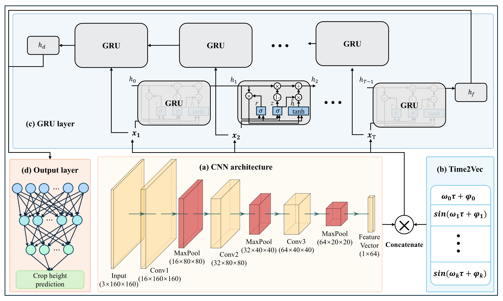

# Rice-STNet
## Official implementation of Rice-STNet for rice plant height estimation from multi-temporal UAV RGB imagery

---

## Overview

Rice-STNet is a spatiotemporal deep learning framework developed for accurate rice plant height estimation from multi-temporal UAV RGB imagery. The framework integrates convolutional neural networks (CNNs) for spatial feature extraction, a Time2Vec embedding layer for explicit temporal encoding, and a gated recurrent unit (GRU) network for modeling sequential dependencies. Multi-date observations are organized as time-series inputs, enabling the model to jointly learn canopy structure and growth trajectories.
<p align="center">

</p>

*Figure 1.* Overall architecture of Rice-STNet.
---

## Features

- End-to-end rice plant height estimation
- Multi-temporal UAV RGB image input
- CNN-based spatial feature extraction
- GRU-based temporal modeling
- Time2Vec temporal encoding
- Comparison with conventional machine learning methods
- High-resolution field-scale plant height mapping

---

## Repository Structure

```text
Rice-STNet
│
├── Figures/
│   └── framework.png               # Model architecture diagram
│
├── MachineLearningMethods/
│   ├── MakeDataInput.py            # Read and process data
│   ├── RF.py                       # Random Forest 
│   ├── SVR.py                      # Support Vector Regression
│   └── commonFunction.py           # General Functions and Classes
│
├── RiceSTNet/
│   ├── dataset/                    # Folder for storing data
│   │   ├── dataset.json            # All data summary
│   │   ├── train.json              # Data for training
│   │   └── test.json               # Data for testing
│   │
│   ├── RiceSTNet.py                # Rice-STNet model structure
│   ├── trainModel.py               # Training pipeline
│   ├── testModel.py                # Testing pipeline
│   ├── Optimization.py             # Hyperparameter optimization
│   ├── makejson.py                 # Save data in JSON format
│   ├── splitjs.py                  # Split the dataset
│   ├── MSRCP.py                    # Function of MSRCP algorithm
│   └── commonFunction.py           # General Functions and Classes
│
├── SimpleCNN/
│   ├── dataset/                    # Folder for storing data 
    │   ├── dataset.json            # All data summary
│   │   ├── train.json              # Data for training
│   │   └── test.json               # Data for testing 
│   ├── simpleCNN.py                # Baseline CNN model structure
│   ├── trainCNN.py                 # Training pipeline
│   ├── testCNN.py                  # Testing pipeline
│   └── commonFunction.py           # General Functions and Classes
│
├── Visualization/
│   ├── weights/                    # Folder for storing weights
    │   └── best_train_model.pth    # The optimal weight of the trained model
│   ├── HeatMap_3D.py               # Program for drawing 3D heat maps
│   ├── HeatMap.py                  # Program for drawing heat maps
│   ├── MSRCP.py                    # Function of MSRCP algorithm
│   ├── commonFunction.py           # General Functions and Classes
│   └── RiceSTNet.py                # Rice-STNet model structure
│
├── README.md
├── LICENSE
├── requirements.txt
└── .gitignore
```

---

## Requirements

Python 3.10 or later is recommended.

Main packages include

- PyTorch
- torchvision
- numpy
- pandas
- OpenCV
- rasterio
- matplotlib
- tqdm
- scikit-learn
- Optuna

Install all dependencies using

```bash
pip install -r requirements.txt
```

---

## Dataset Preparation

The original UAV imagery is not included in this repository because of its large storage size.
Data can be provided upon request.

The provided JSON files illustrate the expected data organization.

---

## Hyperparameter optimization

Optimize hyperparameter by using

```bash
python RiceSTNet/Optimization.py
```
---

## Training

Train the proposed Rice-STNet model using

```bash
python RiceSTNet/trainModel.py
```

---

## Model Evaluation

Evaluate the trained model using

```bash
python RiceSTNet/testModel.py
```

---

## Conventional Machine Learning Baselines

Random Forest

```bash
python MachineLearningMethods/RF.py
```

Support Vector Regression

```bash
python MachineLearningMethods/SVR.py
```

---

## Visualization

Generate field-scale plant height maps and KDE curves

```bash
python Visualization/HeatMap.py
```

Generate 3D visualization

```bash
python Visualization/HeatMap_3D.py
```